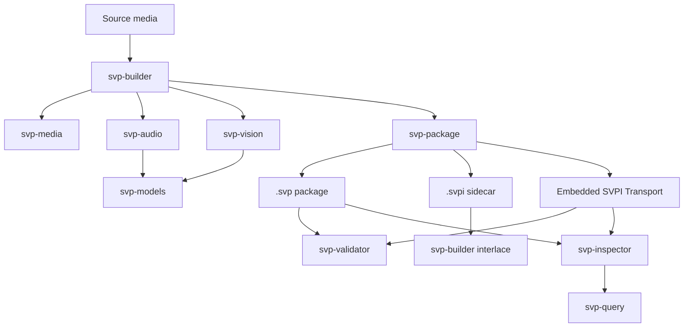

# SVP: Semantic Video Package

SVP is an open standard for strict, machine-readable semantic packaging of
time-based media.

A `.svp` package is not an AI plugin format and not merely an MP4 wrapper. It
is a baked media observation package containing source media, transcript words,
speaker timing, visible text, color observations, timeline records,
relationships, depth, embeddings, index data, provenance, validation metadata,
and manifest data.

The philosophy is simple:

- SVP Core stores observations, not interpretations.
- Labels are non-core.
- AI may consume SVP, but AI does not define SVP.
- A conforming `.svp` package must be strict, complete, inspectable, and
  validator-testable.
- The reference builder is machinery. The package format is the standard.

## Current Status

SVP v1.0 RC2 is the active implementation target. This repository now contains
the spec, validator, package writer, query/inspection tools, SVPI sidecar
support, and a real builder path that can produce validator-clean `.svp`
packages from local sample media when the required native tools and model cache
are available.

Recent real-video proof paths include:

| Sample | What it proves |
| --- | --- |
| `test-30.mp4` | OCR text/numeric extraction, transcript, color, depth, relationships, timeline, and one-speaker diarization behavior. |
| `SVP-TEST.MOV` | Short handwritten-text OCR and evidence-crop behavior. |
| `CODE.MOV` | Full transcript recovery, deterministic OCR temporal coverage, scene/color grouping, timeline relationships, and agent-readable package reconstruction. |
| `intro.mp4` | Whisper word confidence propagation and speaker speech-duration accounting. |
| `speakers.MOV` | Real sherpa-onnx diarization with two speakers when runtime and model bundles are available. |

The known current gap is no longer basic package validity. The active work is
completion and hardening: semantic quality, query traversal, deterministic
entity and relationship behavior, model-bundle checks, package hygiene, and
validator coverage.

## What This Repository Contains

| Path | Purpose |
| --- | --- |
| `spec/` | SVP v1.0 RC1/RC2 specs, schemas, registries, review notes, and companion specs. |
| `docs/` | Implementation plans, SVPI draft spec, roadmap notes, glossary, OCR baseline notes, and orchestration plan. |
| `packages/svp-core/` | Core shared types and helpers. |
| `packages/svp-media/` | Media probing, canonical timing, and source media planning. |
| `packages/svp-audio/` | Audio extraction, Whisper ASR, transcript writing, speaker records, and diarization. |
| `packages/svp-vision/` | OCR, color observations, evidence crops, depth, embeddings, and timeline-related vision staging. |
| `packages/svp-models/` | Model manifest verification and ONNX Runtime session handling. |
| `packages/svp-package/` | SVP/SVPI package writing, timeline artifacts, relationship/provenance writing, media binding, SVPI media policy, and validation output storage. |
| `packages/svp-query/` | Read/query helpers used by inspector tooling. |
| `packages/svp-validation/` | Validator library and validation-code handling. |
| `tools/svp-builder/` | Reference CLI for building SVP packages and SVPI sidecars from source media. |
| `tools/svp-validator/` | CLI for validating `.svp` packages. |
| `tools/svp-inspector/` | CLI for inspecting and querying package contents. |
| `tools/svp-models-tool/` | Model-bundle verification utility. |
| `fixtures/` | Small package fixtures for validator and reader behavior. |
| `scripts/` | Utility scripts, spec checks, fixture generation, and reports. |

## SVP Package Expectations

An SVP package is ZIP-based and uses this MIME type:

```text
application/vnd.svp+zip
```

Current real builder output may include these layer families:

| Layer | Examples |
| --- | --- |
| Core package files | `mimetype`, `manifest.json` |
| Transcript | `transcript/transcript.json`, `words.jsonl`, `speakers.jsonl`, `speaker_segments.jsonl` |
| Text/OCR | `text_regions.jsonl`, `text_observations.jsonl`, `numeric_values.jsonl`, `evidence_crops.jsonl`, `text_absence.json` |
| Color | `color_observations.jsonl`, `color_summary.json`, `color_absence.json` |
| Timeline | `frames.jsonl`, `shots.jsonl`, `scenes.jsonl` |
| Spatial/depth/embeddings | depth blocks, embedding indexes, source-derived text embeddings |
| Relationships | `relationships/relationships.jsonl` plus relationship processor provenance |
| Index | SQLite/index manifest outputs |
| Provenance | processor records and stored validation output |

Current real builder output may include transcript, OCR/text, color, timeline,
entities, spatial/depth, embeddings, relationship, index, provenance, and
stored validation artifacts when the relevant local tools and model cache are
available.

## SVPI Sidecars

SVPI stands for Semantic Video Package Interlace. An `.svpi` file is a
media-bound semantic sidecar: it stores SVP-compatible observations, indexes,
provenance, validation metadata, and media identity binding without embedding
the primary source media.

```text
SVP  = packaged source media + semantic observations
SVPI = media-bound semantic observations + no packaged primary media
```

SVPI is useful when a workflow wants semantic understanding beside existing
media libraries without rewriting or copying the media file into an `.svp`
container first. A valid SVPI can be inspected and searched without the source
media present, but recombination into a full `.svp` requires a candidate source
media file that verifies against `media_binding.json`.

The important storage rule is strict:

- SVPI MUST NOT contain `media/original/`.
- SVPI MUST NOT contain replayable source-derived audio/video/muxed media,
  including extracted audio streams, proxy video, or analysis WAV/FLAC files.
- SVPI MAY contain non-replayable evidence and observations such as OCR crops,
  readable still evidence, waveform envelopes, transcript words, speaker
  segments, audio absence, stream hashes, chunk hashes, and provenance.

The SVPI draft spec lives at:

```text
docs/svpi/SVPI_v0.1_Draft_Specification.md
```

## Embedded SVPI Transport

An SVPI can also be transported inside a supported ISO Base Media File Format
container without changing its semantic meaning. The transport stores one
complete, unmodified canonical SVPI in a registered top-level `uuid` box. It
does not transcode media or split semantic sections into container-native
boxes.

```text
sidecar:      media.mov + media.svpi
single file:  media-with-semantics.mov = original container bytes + canonical SVPI
```

Version 1 structurally detects MP4, QuickTime MOV, M4V, and M4A brand families.
Its UUID is `e2b6a23c-22ca-5636-b165-991208c837f1`. The complete binary
contract, placement rules, validation codes, and preservation limits are in
[`docs/svpi/Embedded_SVPI_Transport_ISO_BMFF_v1.md`](docs/svpi/Embedded_SVPI_Transport_ISO_BMFF_v1.md).
The retained native macOS integration design is documented in
[`docs/macos/Embedded_SVPI_System_Support.md`](docs/macos/Embedded_SVPI_System_Support.md).

## Architecture



The validator is the spine of the project. Builder output is not considered
complete just because a ZIP file exists. A package claim is complete only when
the generated package is inspectable and the validator passes.

## Requirements

The core C++ project expects:

- CMake and a C++20-capable compiler.
- FFmpeg and ffprobe for media probing/extraction.
- whisper.cpp for local ASR with word-level timestamps.
- ONNX Runtime for OCR, depth, and embedding model paths.
- A local SVP model cache for full media builds.
- Optional sherpa-onnx C API dynamic library for real diarization.

Common local tool paths on the primary development machine:

```text
/opt/homebrew/bin/ffmpeg
/opt/homebrew/bin/ffprobe
/Users/domesposito/Projects/svp-model-cache
```

Normal `svp build` operation must not require Python. Python-installed
sherpa-onnx may provide a dynamic library, but the builder should load the C API
library directly rather than shelling out to Python.

## Build

Configure and build:

```bash
cmake -S . -B build -DCMAKE_BUILD_TYPE=Debug
cmake --build build --parallel
```

Build focused tools:

```bash
cmake --build build --target svp-builder
cmake --build build --target svp-validator
cmake --build build --target svp-inspector
```

Run tests:

```bash
ctest --test-dir build --output-on-failure
```

Verify required spec files:

```bash
scripts/verify-spec-files.sh
```

## Install the reference models

On Apple Silicon macOS, install the exact eight-model set used by the SVP
pipeline with:

```bash
./build/tools/svp-models-tool/svp-models-tool install
```

The default model cache is:

```text
~/Library/Application Support/SVP/Models/v1
```

Print the effective path or choose a different folder explicitly:

```bash
./build/tools/svp-models-tool/svp-models-tool path
./build/tools/svp-models-tool/svp-models-tool path --cache-dir /path/to/models
./build/tools/svp-models-tool/svp-models-tool install --cache-dir /path/to/models
```

Downloads run one model job at a time by default. At most two may run together:

```bash
./build/tools/svp-models-tool/svp-models-tool install --parallel-downloads 2
```

Every source, generated file, bundle, and the complete root model set is
verified before the staged cache is published. A failed or interrupted install
does not publish a partial cache. PP-OCR and RF-DETR are recreated from their
pinned upstream files with a temporary hash-locked conversion environment,
which is removed after installation. SVP does not host or substitute model
weights, and `svp build` never downloads or updates models.

## Build an SVP Package

Example using a local sample and model cache:

```bash
mkdir -p build/local-intro

./build/tools/svp-builder/svp-builder build \
  /Users/domesposito/Projects/samples/intro.mp4 \
  --out build/local-intro/intro.svp \
  --model-cache /Users/domesposito/Projects/svp-model-cache \
  --ffmpeg /opt/homebrew/bin/ffmpeg \
  --ffprobe /opt/homebrew/bin/ffprobe
```

If sherpa-onnx is installed in a nonstandard location, pass the C API library
explicitly:

```bash
./build/tools/svp-builder/svp-builder build \
  /path/to/video.mov \
  --out build/local-video/video.svp \
  --model-cache /Users/domesposito/Projects/svp-model-cache \
  --sherpa-lib /path/to/libsherpa-onnx-c-api.dylib
```

The builder can also stop at earlier foundation stages:

```text
media-ingest
audio
vision-plan
foundation-color
foundation-ocr
package
```

## Create and Use SVPI Sidecars

Create a semantic `.svpi` sidecar from source media:

```bash
./build/tools/svp-builder/svp-builder interlace create \
  /path/to/video.mov \
  --out /path/to/video.svpi \
  --model-cache /Users/domesposito/Projects/svp-model-cache \
  --ffmpeg /opt/homebrew/bin/ffmpeg \
  --ffprobe /opt/homebrew/bin/ffprobe \
  --sherpa-lib /path/to/libsherpa-onnx-c-api.dylib
```

Inspect and validate the sidecar:

```bash
./build/tools/svp-builder/svp-builder interlace inspect /path/to/video.svpi

./build/tools/svp-builder/svp-builder interlace validate \
  /path/to/video.svpi \
  --media /path/to/video.mov
```

Extract source media and an `.svpi` sidecar from an existing `.svp` package:

```bash
./build/tools/svp-builder/svp-builder interlace extract \
  /path/to/video.svp \
  --out-dir /path/to/extracted
```

That command writes both the embedded source media and a matching `.svpi`.

Recombine source media plus SVPI into a full `.svp`:

```bash
./build/tools/svp-builder/svp-builder interlace recombine \
  /path/to/video.mov \
  /path/to/video.svpi \
  --out /path/to/recombined.svp
```

Build a complete Embedded SVPI Transport directly through the normal build
command:

```bash
./build/tools/svp-builder/svp-builder build \
  /path/to/video.mov \
  --out /path/to/video-with-semantics.mov \
  --output-format embedded-svpi \
  --model-cache /path/to/svp-model-cache \
  --sherpa-lib /path/to/libsherpa-onnx-c-api.dylib
```

The same command accepts `--output-format svp` (the default) and
`--output-format svpi`.

Embed an existing SVPI, extract it exactly, or reconstruct the clean container:

```bash
./build/tools/svp-builder/svp-builder transport embed \
  /path/to/video.mov /path/to/video.svpi \
  --out /path/to/video-with-semantics.mov

./build/tools/svp-builder/svp-builder transport extract \
  /path/to/video-with-semantics.mov \
  --out /path/to/extracted.svpi

./build/tools/svp-builder/svp-builder transport strip \
  /path/to/video-with-semantics.mov \
  --out /path/to/clean.mov
```

Existing embeddings require `--replace-existing`; existing output paths
require explicit `--overwrite`. User-facing outputs must retain the suffix for
the structurally detected family: `.mp4`, `.mov`, `.m4v`, or `.m4a`.

Batch workflows are also available:

```bash
./build/tools/svp-builder/svp-builder interlace create-batch \
  /path/to/media-dir \
  --output-format svpi \
  --recursive

./build/tools/svp-builder/svp-builder interlace create-batch \
  /path/to/media-dir \
  --output-format embedded-svpi \
  --out-dir /path/to/semantic-media \
  --recursive

./build/tools/svp-builder/svp-builder interlace scan /path/to/media-dir --recursive
./build/tools/svp-builder/svp-builder interlace validate-batch /path/to/media-dir --recursive
./build/tools/svp-builder/svp-builder interlace complete-identity-batch /path/to/media-dir --recursive
```

Sidecar naming modes for `create-batch` are `visible`, `hidden`, and
`managed-dir`. They apply only to `--output-format svpi`. Embedded batch
output preserves source-relative filenames and container suffixes beneath the
required separate `--out-dir`. To intentionally replace every source in place,
omit `--out-dir` and pass explicit `--overwrite`; each item is written,
verified, and atomically published through the same transport writer used by
the one-file command. `--replace-mismatched` permits rebuilding a stale or
invalid artifact in a separate output directory but does not grant permission
to overwrite source media.

## Validate and Inspect

Validate an SVP, SVPI, or Embedded SVPI Transport:

```bash
./build/tools/svp-validator/svp-validator validate build/local-intro/intro.svp
./build/tools/svp-validator/svp-validator validate /path/to/video-with-semantics.mov --json
```

Emit machine-readable validation JSON:

```bash
./build/tools/svp-validator/svp-validator validate build/local-intro/intro.svp --json
```

Print a concise package summary:

```bash
./build/tools/svp-inspector/svp-inspector inspect build/local-intro/intro.svp
./build/tools/svp-inspector/svp-inspector inspect /path/to/video-with-semantics.mov --json
```

`svp-inspector` can inspect and query `.svpi` packages and Embedded SVPI
Transport files through the same bounded package reader. Embedded validation
compares a present SVPI full-file BLAKE3 binding with the logical clean
container bytes.

List package layers:

```bash
./build/tools/svp-inspector/svp-inspector query build/local-intro/intro.svp --mode layers
./build/tools/svp-inspector/svp-inspector query /path/to/video-with-semantics.mov --mode layers
```

Query transcript words:

```bash
./build/tools/svp-inspector/svp-inspector query build/local-intro/intro.svp --mode words --text "serious"
```

Query OCR:

```bash
./build/tools/svp-inspector/svp-inspector query build/local-intro/intro.svp --mode ocr
```

Query speakers:

```bash
./build/tools/svp-inspector/svp-inspector query build/local-intro/intro.svp --mode speakers
```

## Model Cache Notes

Full media builds depend on model bundles in the local model cache. Current
runtime paths include:

- Whisper Small English GGML weights executed by whisper.cpp for ASR.
- PP-OCRv6 detector/recognizer ONNX bundles for visible text.
- RF-DETR Nano FP32 ONNX weights for visual entity proposals.
- Depth and embedding model bundles.
- sherpa-onnx diarization model files for speaker diarization.

Model identity should be proven through manifests and hashes before a model is
trusted. Missing models should produce honest absence/blocker records rather
than fake observations.

## Active Implementation Focus

Current work should remain narrow, reviewable, and validator-backed. The next
important lanes are:

1. Deterministic entity and entity-track quality.
2. Relationship traversal and graph-health hardening over package output.
3. Mask, spatial-region, and spatial-relationship foundations.
4. Timeline/scene quality hardening beyond sampled-frame interval evidence.
5. Transcript, OCR, color, vision, and embedding quality improvements.
6. Strict validator coverage for speaker, diarization, relationship, entity,
   model-bundle, SVPI, and package-hygiene rules.

Do not replace validator-backed package work with hand-assembled output. A
builder claim is complete only when the generated package is inspectable and
the validator passes.

## Related Repositories

The companion macOS support repository lives at:

```text
/Users/domesposito/Projects/svp-system-support
```

That project registers `.svp` with macOS, provides Quick Look previews, and
exposes package media through a MediaExtension reader. This repository remains
the spec, builder, validator, package, and query implementation.
