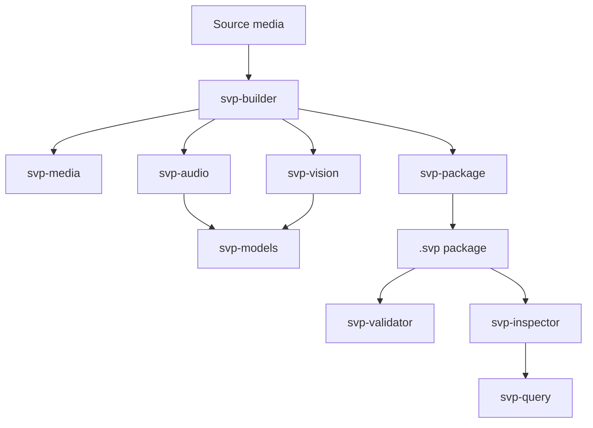

# SVP: Semantic Video Package

SVP is an open standard for strict, machine-readable semantic packaging of
time-based media.

A `.svp` package is not an AI plugin format and not merely an MP4 wrapper. It
is a baked media observation package containing source media, transcript words,
speaker timing, visible text, color observations, timeline records,
relationships, depth, embeddings, index data, provenance, validation metadata,
and manifest data.

The philosophy is simple:

- SVP Core stores observations, not interpretations.
- Labels are non-core.
- AI may consume SVP, but AI does not define SVP.
- A conforming `.svp` package must be strict, complete, inspectable, and
  validator-testable.
- The reference builder is machinery. The package format is the standard.

## Current Status

SVP v1.0 RC2 is the active implementation target. This repository now contains
the spec, validator, package writer, query/inspection tools, and a real builder
path that can produce validator-clean `.svp` packages from local sample media
when the required native tools and model cache are available.

Recent real-video proof paths include:

| Sample | What it proves |
| --- | --- |
| `test-30.mp4` | OCR text/numeric extraction, transcript, color, depth, relationships, timeline, and one-speaker diarization behavior. |
| `SVP-TEST.MOV` | Short handwritten-text OCR and evidence-crop behavior. |
| `CODE.MOV` | Full transcript recovery, deterministic OCR temporal coverage, scene/color grouping, timeline relationships, and agent-readable package reconstruction. |
| `intro.mp4` | Whisper word confidence propagation and speaker speech-duration accounting. |
| `speakers.MOV` | Real sherpa-onnx diarization with two speakers when runtime and model bundles are available. |

The known current gap is no longer basic package validity. The active work is
completing remaining semantic layers and hardening quality, query traversal,
entities/tracks, masks/regions, model-bundle checks, and validator coverage.

## What This Repository Contains

| Path | Purpose |
| --- | --- |
| `spec/` | SVP v1.0 RC1/RC2 specs, schemas, registries, review notes, and companion specs. |
| `docs/` | Implementation plans, roadmap notes, glossary, OCR baseline notes, and orchestration plan. |
| `packages/svp-core/` | Core shared types and helpers. |
| `packages/svp-media/` | Media probing, canonical timing, and source media planning. |
| `packages/svp-audio/` | Audio extraction, Whisper ASR, transcript writing, speaker records, and diarization. |
| `packages/svp-vision/` | OCR, color observations, evidence crops, depth, embeddings, and timeline-related vision staging. |
| `packages/svp-models/` | Model manifest verification and ONNX Runtime session handling. |
| `packages/svp-package/` | Package writing, timeline artifacts, relationship/provenance writing, and validation output storage. |
| `packages/svp-query/` | Read/query helpers used by inspector tooling. |
| `packages/svp-validation/` | Validator library and validation-code handling. |
| `tools/svp-builder/` | Reference CLI for building SVP package artifacts from source media. |
| `tools/svp-validator/` | CLI for validating `.svp` packages. |
| `tools/svp-inspector/` | CLI for inspecting and querying package contents. |
| `tools/svp-models-tool/` | Model-bundle verification utility. |
| `fixtures/` | Small package fixtures for validator and reader behavior. |
| `scripts/` | Utility scripts, spec checks, fixture generation, and reports. |

## SVP Package Expectations

An SVP package is ZIP-based and uses this MIME type:

```text
application/vnd.svp+zip
```

Current real builder output may include these layer families:

| Layer | Examples |
| --- | --- |
| Core package files | `mimetype`, `manifest.json` |
| Transcript | `transcript/transcript.json`, `words.jsonl`, `speakers.jsonl`, `speaker_segments.jsonl` |
| Text/OCR | `text_regions.jsonl`, `text_observations.jsonl`, `numeric_values.jsonl`, `evidence_crops.jsonl`, `text_absence.json` |
| Color | `color_observations.jsonl`, `color_summary.json`, `color_absence.json` |
| Timeline | `frames.jsonl`, `shots.jsonl`, `scenes.jsonl` |
| Spatial/depth/embeddings | depth blocks, embedding indexes, source-derived text embeddings |
| Relationships | `relationships/relationships.jsonl` plus relationship processor provenance |
| Index | SQLite/index manifest outputs |
| Provenance | processor records and stored validation output |

Some layers are still intentionally incomplete. In particular,
`entities/entities.jsonl` and `entities/entity_tracks.jsonl` are the next major
structural gap for real packages.

## Architecture



The validator is the spine of the project. Builder output is not considered
complete just because a ZIP file exists. A package claim is complete only when
the generated package is inspectable and the validator passes.

## Requirements

The core C++ project expects:

- CMake and a C++20-capable compiler.
- FFmpeg and ffprobe for media probing/extraction.
- ONNX Runtime for model-backed ASR/OCR/depth/embedding paths.
- A local SVP model cache for full media builds.
- Optional sherpa-onnx C API dynamic library for real diarization.

Common local tool paths on the primary development machine:

```text
/opt/homebrew/bin/ffmpeg
/opt/homebrew/bin/ffprobe
/Users/domesposito/Projects/svp-model-cache
```

Normal `svp build` operation must not require Python. Python-installed
sherpa-onnx may provide a dynamic library, but the builder should load the C API
library directly rather than shelling out to Python.

## Build

Configure and build:

```bash
cmake -S . -B build -DCMAKE_BUILD_TYPE=Debug
cmake --build build --parallel
```

Build focused tools:

```bash
cmake --build build --target svp-builder
cmake --build build --target svp-validator
cmake --build build --target svp-inspector
```

Run tests:

```bash
ctest --test-dir build --output-on-failure
```

Verify required spec files:

```bash
scripts/verify-spec-files.sh
```

## Build an SVP Package

Example using a local sample and model cache:

```bash
mkdir -p build/local-intro

./build/tools/svp-builder/svp-builder build \
  /Users/domesposito/Projects/samples/intro.mp4 \
  --out build/local-intro/intro.svp \
  --staging-dir build/local-intro/staging \
  --model-cache /Users/domesposito/Projects/svp-model-cache \
  --ffmpeg /opt/homebrew/bin/ffmpeg \
  --ffprobe /opt/homebrew/bin/ffprobe \
  --stop-after package-skeleton
```

If sherpa-onnx is installed in a nonstandard location, pass the C API library
explicitly:

```bash
./build/tools/svp-builder/svp-builder build \
  /path/to/video.mov \
  --out build/local-video/video.svp \
  --staging-dir build/local-video/staging \
  --model-cache /Users/domesposito/Projects/svp-model-cache \
  --sherpa-lib /path/to/libsherpa-onnx-c-api.dylib \
  --stop-after package-skeleton
```

The builder can also stop at earlier foundation stages:

```text
media-ingest
audio
vision-plan
foundation-color
foundation-ocr
package-skeleton
```

## Validate and Inspect

Validate a package:

```bash
./build/tools/svp-validator/svp-validator validate build/local-intro/intro.svp
```

Emit machine-readable validation JSON:

```bash
./build/tools/svp-validator/svp-validator validate build/local-intro/intro.svp --json
```

Print a concise package summary:

```bash
./build/tools/svp-inspector/svp-inspector inspect build/local-intro/intro.svp
```

List package layers:

```bash
./build/tools/svp-inspector/svp-inspector query build/local-intro/intro.svp --mode layers
```

Query transcript words:

```bash
./build/tools/svp-inspector/svp-inspector query build/local-intro/intro.svp --mode words --text "serious"
```

Query OCR:

```bash
./build/tools/svp-inspector/svp-inspector query build/local-intro/intro.svp --mode ocr
```

Query speakers:

```bash
./build/tools/svp-inspector/svp-inspector query build/local-intro/intro.svp --mode speakers
```

## Model Cache Notes

Full media builds depend on model bundles in the local model cache. Current
runtime paths include:

- ONNX Whisper Small English for ASR.
- PP-OCRv6 detector/recognizer ONNX bundles for visible text.
- Depth and embedding model bundles.
- sherpa-onnx diarization model files for speaker diarization.

Model identity should be proven through manifests and hashes before a model is
trusted. Missing models should produce honest absence/blocker records rather
than fake observations.

## Active Implementation Focus

Current work should remain narrow, reviewable, and validator-backed. The next
important lanes are:

1. Entity and entity-track artifacts.
2. Relationship traversal queries over package graph output.
3. Mask and spatial-region foundations.
4. Timeline/scene quality hardening beyond sampled-frame interval evidence.
5. Transcript, vision, and embedding quality improvements.
6. Strict validator coverage for speaker, diarization, relationship, entity,
   model-bundle, and package-hygiene rules.

Do not replace validator-backed package work with hand-assembled output. A
builder claim is complete only when the generated package is inspectable and
the validator passes.

## Related Repositories

The companion macOS support repository lives at:

```text
/Users/domesposito/Projects/svp-system-support
```

That project registers `.svp` with macOS, provides Quick Look previews, and
exposes package media through a MediaExtension reader. This repository remains
the spec, builder, validator, package, and query implementation.
